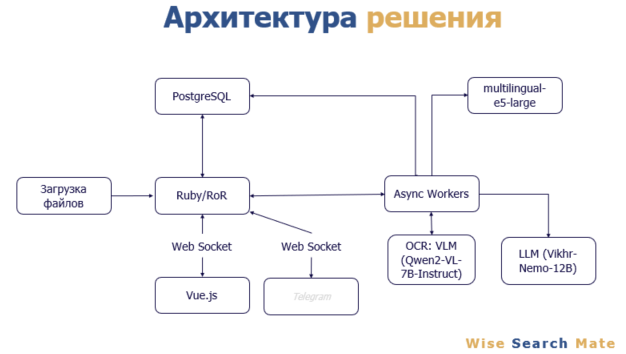

# Media Wise Помощник 

### архитектура решения


### Запуск
```bash
docker-compose down && docker-compose up --build
```

### Прозрачность данных
В файле app/jobs/llm_job.rb находится job который подготваливает ответ для пользователя.

В файле models/llm происходит запрос на LLM

В файле models/semantic_search.rb происходит поиск контекста в базе данных

На странице https://media-wise-api.kovalev.team/admin/message можно видеть список всех сообщенией 
в системе и если зайти в какое нибудь сообщение можно увидеть контекст который был отправлен в LLM и референсы на слайды из которых взят контекст

### Основные пути
- [Чатбот](https://media-wise.kovalev.team) можно зайти под гостем или под админом `manager:zak2`
- [Админка](https://media-wise-api.kovalev.team/admin)
- [Поиск по корпусу статей](https://media-wise-api.kovalev.team/articles)
- [Загрузка статей](https://media-wise-api.kovalev.team/articles/new)

------
## LLM
Находится в папке LLM в корне репозитория

Нужно добавить свой ключ ngrok, для проксирования

файл  LLM/hf.py содержит код запуска инференса LLM через huggingface

файл  LLM/vllm.py содержит код запуска инференса VLLM,которая ускоряет инференс в 3 раза

Используем модель Vikhr-Nemo-12B

Можно в целом поменять модель с Phi-3 и все заведется

-----
## Encoder
в папке encoder лежит енкодер который используется для извлечения эмбедингов из текста.
Используется модель multilingual-e5-large лицензия MIT
-----
## Парсинг слайдов
Все презентации, статьи и другие документы загружаются пользователем в систему. Большие файлы (больше 100 слайдов картинками) могут занять определенное время на распознование

## Как работает

В системе были заранее спаршены с помощью VLM Qwen2-VL-7B-Instruct предоставленнные слайды, где полный спаршенный текст, в том числе со слайдов картинок, дополнительная информация о графиках, таблицах и т.д. на естественном языке. Графики и гистрограммы тоже учитываются, если какой-то параметр будет больше, это VLM учтется. Далее 4 спаршенных ближайших контекста, мы отправляем в LLM Vikhr-Nemo-12B, где она отделяет самые важные контектсты, которые подходят к вопросу, т.е. это доп фильтрация. После того, как LLM отфильтровалаэти контексты, то отвечает только по ним, что позволило улучшить качество.